1. View all users

	SELECT * FROM users;

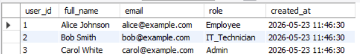

2. View all open tickets

	SELECT * 
	FROM tickets
	WHERE status = 'open';

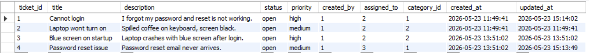

3.  Show ticket titles and priorities

	SELECT title, priority
	FROM tickets;

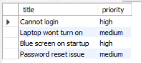

4. Find all high priority tickets

	SELECT *
	FROM tickets
	WHERE priority = 'high';

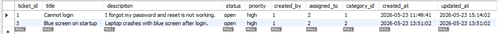

5. Sort tickets by creation date 

	SELECT *
	FROM tickets
	ORDER BY created_at ASC;

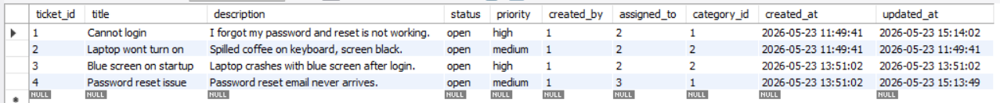

6. Sort tickets by creation date (newest first)

	SELECT *
	FROM tickets
	ORDER BY created_at DESC;

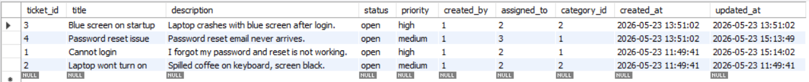

7. Show tickets with the creator's name

	SELECT t.ticket_id, t.title, u.full_name AS created_by
	FROM tickets t
	JOIN users u
	ON t.created_by = u.user_id;

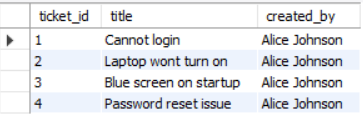

8. Show tickets and assigned technician

	SELECT t.ticket_id, t.title, u.full_name AS assigned_to
	FROM tickets t
	JOIN users u 
	ON t.assigned_to = u.user_id;

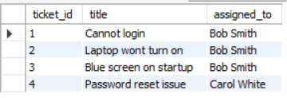

9.  Show comments with ticket title

	SELECT c.comment_text, t.title
	FROM comments c
	JOIN tickets t
	ON c.ticket_id = t.ticket_id;

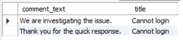

10. Show comments with the author's name

	SELECT c.comment_id, c.comment_text, u.full_name
	FROM comments c
	JOIN users u
	ON c.user_id = u.user_id;

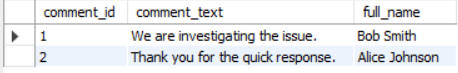

11. Count total tickets 

	SELECT COUNT(*) AS total_tickets
	FROM tickets;

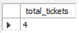

12.  Count tickets by priority

	SELECT priority, COUNT(*) as total_tickets
	FROM tickets
	GROUP BY priority;

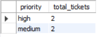

13.  Change ticket status

	UPDATE tickets
	SET status = 'in_progress'
	WHERE ticket_id = 1;

	SELECT * FROM tickets;

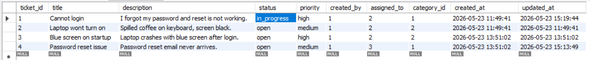

14.  Assign a ticket to another technician

	UPDATE tickets
	SET assigned_to = 2
	WHERE ticket_id = 4; 

	SELECT * FROM tickets;

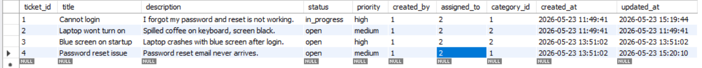

